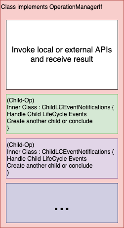

This article describes the design of an application framework which helps in implementation of business procedures using orchestration with microservices. 

The design provides 
- Data model, 
- Programming model and 
- A set of constraints 

which induce benefits listed at the end of this article.

### Background

#### Business Procedure

A business procedure is a tree of operations, that together, accomplish a business task.

For example, in an e-commerce business, completing an order may invo­­lve below operations and sub-operations

- Payment
  - Credit cards, e-wallets
- Procurement from seller
- Shipping
  - Packaging
- Email, SMS Verifications


Fig: Op Tree


The tree could be of arbitrary depth. For example, payment processing may involve, applying coupon codes, promotions, discounts in addition to talking to external payment gateways, e-wallets etc.

#### Microservices

A system could be split into microservices by any one of various decomposition methods. (Using bounded contexts of Domain Driven Design is one). Irrespective of the method, a microservice operates with one or few focused concerns.

E.g., a separate microservice could be responsible for handling payments.

So business procedures invariably span multiple microservices.

#### Orchestration

'Orchestration' is an design where a single microservice (say, &#39;owner&#39;), provides a business procedure as a service. It provides this service by implementing an execution plan and progressing a &#39;cursor&#39; on the plan and invoking services of other microservices wherever needed. That is -- the owner microservice acts as controller.

An execution plan creates a topology of microservices.


Execution of procedure could look like this:


##### Intra-microservice Orchestration

If a microservice is organized into modules or layers with clear boundaries, there could be orchestration within microservices too.


##### Orchestration View

A view of intra and inter microservices orchestration is depicted in diagram below.


Fig: Op Data Tree


### Design

#### Data Model

A business procedure is modelled as a tree of operations (*Op tree*) that spans within and across microservices. An &#39;operation&#39; is a unit of work.

Running a procedure generates data. 'Operation Data' (*Op data*) is the data created by each operation during a run.

'Operation Data Tree'; (*Op data tree*) is a tree of op data created with the same structure as op tree. One op data tree is created for every procedure run.


While op data differs for every type of operation, below common attributes are prescribed

- Unique operation invocation identifier.
- State (Say - InProgress, Failed, Success, Expired)
- Parent operation identifier
- Child operation identifiers
- Root operation identifier
- Error

When we have op data tree, there is no need for a separate state machine. The tree itself serves as a consolidated state machine. This is so much better than having a single state machine in each microservice.

#### Microservice API Model

To effectively implement sagas, we define following API model.

1. APIs must allow callers to set a timeout period, beyond which a callee ceases to continue with any further actions associated with the API.
  1. APIs must succeed or fail within timeout period. Else, they are considered to be &#39;expired&#39;.
  2. This is inline with states of op data (see above).
2. If required by callers, a microservice must provide an API to reverse a performed action.


#### Op Manager

An operation manager is an entity which performs actions associated with an operation. A framework creates this manager as soon as someone creates an op data and requests initiation by dispatching an event.

A unique op manager type exists for every unique op data type. For e.g., &#39;SendOTPData&#39; OD class is associated with &#39;SendOTPManager&#39; class.

- It manages the life-cycle of an operation.
- It reads and writes to op data it is associated with
- It performs any number of local actions such as calling other internal APIs, etc.
- It invokes at most one external API. (If more than one API needs to be called, the operation must be split into multiple)
- It can delegate by creating any number of child operations.
- It enforces timeout period.
- It concludes result of operation as success/failure/expiry.
- It notifies manager of parent operation with result, as an event.


Fig: View of op manager with associated op data


Fig: Life-cycle event flows with op manager


#### Modus Operandi

Putting all together, an op tree is executed as follows.

1. Op data for top level operation is created in database. Say OD-1.
2. OD-1 is initiated.
3. An op manager which can handle op data is created.
4. It does these things
  1. Optionally, it invokes one or more local service APIs
  2. Optionally, it invokes an external API and gets result (Success/Failure/Expiry). This alone may determine the result of this operation or it may be preceded by, succeeded by or sandwiched in-between one or more child operations.
  3. It runs child operations (if any) sequentially. That is it creates and initiates a child OD and waits for result from its OM before proceeding to next child operation.
  4. It can run child operations in parallel as well.
  5. It responds to failure of child operations by creating yet another child operation dedicated for reversing any previous operation(s) (if the operation is transactional in nature).

This is recursively applied to each and every operation.


#### Programming Model

A model to implement an op manager and child receptors is to use class and nested classes as shown below.


Life-cycle event flows with op manager

Diagram below shows a model of a class which implements an operation manager.

At a high level, it has the two sections

- Part which handles the invocation and handling of responses of internal or external API calls.
- Child operation event handlers.

Although the child receptors can be created in a separate class, putting them in inner class provides a unified view of the operation manager in a single place. This is especially the case since most of the meat of the operation activity is in the details of how it handles child life cycle events.

The inner class also depicts the parent-child relationship and helps comprehend an operation manager in a much easier way.




#### Examples

##### 'One Time Password' Example

Requirement: There are two ways to send OTP to user - via SMS and/or Email. Sending OTP over email if sending over SMS fails. Do not send OTP over email if mobile number is invalid.

It begins with some part of the system initiating OneTimePasswordConfirmationManager. onInitiate() is chartered to do the work of a sending OTP. It first creates a child transaction PurchaseOTPNotifierOverSMS and schedules it. The input parameters for sending SMS are put into the transaction before initiating.

The transaction manager associated with PurchaseOTPNotifierOverSMS does what it is supposed to do and conveys the success/failure/expiry to a dedicated handler setup by OTPNotifierOverSMSChildHandler.

If sending SMS fails, sending email is attempted. If the reason for SMS failure was an &#39;Invalid number&#39;, the transaction is marked as failed immediately.

```java
    public class OneTimePasswordConfirmationManager implements IOperationManager {
        @Override
        public void onInitiate() throws Exception {
            //create otpNotifierOverSMSData
            // otpNotifierOverSMSData.setInputData(MSISDN, ...)
            // otpNotifierOverSMSData.setExpiry()
            //SchedulerHelper.schedule(otpNotifierOverSMSData, expiry)
        }
        @Override
        public void successResult(ErrorDetails result) throws Exception {
            //This is called after an operation is successful
            //Update db fields, cleanup of resources etc.
        }
        @Override
        public void failureResult(ErrorDetails result) throws Exception {
            //This is called after a op has failed
            //Update db fields, cleanup of resources etc.    
        }
        @Override
        public void validityEnded() throws Exception {
            //This is called after a op has expired
            //Update db fields, cleanup of resources etc.
        }
        @Override
        public void handleEvent(Result res) throws Exception {
            //A result of an operation done in handleTxnInitiate is delivered to this manager 
            //e.g., callback, a message from message queue etc.
            //Based on contents, op manager can mark itself as successful/failed
        }
    
        List<ChildOperationEventHandler> getChildLifeCycleHandler(String opType) {
            //return dedicated 
            //return OTPNotifierOverSMSChildHandler and OTPNotifierOverEmailHandler
        }
    
    
        private class OTPNotifierOverSMSChildHandler implements ChildLifeCycleHandler {
            @Override
            public void onChildTxnSuccess(Operation op, Operation childOperation) throws Exception {
                //markSelfAsSuccess(Operation, result(childOperation.getOutputData()));
            }
            @Override
            public void onChildTxnFailed(Operation op, Operation childOperation) throws Exception {
                //result = childOperation.getOutputData()
                //if result says that MSISDN is invalid, flag as invalid account. Else try email
                //if(result.error!=Error.INVALID_MSISDN) { //Say, we don't want to have accounts with invalid number
                tryEmail(Operation, childOperation);
                //} else {
                //op.setOutputData(Error.InvalidNumber,...)
                //markSelfAsFailed(Operation);
                //}
            }
            @Override
            public void onChildOpExpired(Operation op, Operation childOperation) throws Exception {
                tryEmail(op, childOperation);
            }
            private void tryEmail(Operation op, Operation childOperation) {
                //create purchaseOTPNotifierOverEmail
                //otpNotifierOverEmail.setInputData(email, ...)
                //otpNotifierOverEmail.setExpiry()
                //SchedulerHelper.schedule(purchaseOTPNotifierOverEmail, expiry)
            }
        }
    
    
        private class OTPNotifierOverEmailHandler implements ChildOperationEventHandler {
            @Override
            public void onChildOpSuccess(Operation op, Operation childOperation) throws Exception {
            //...
            }
            @Override
            public void onChildOpFailed(Operation op, Operation childOperation) throws Exception {
            //...
            }
            @Override
            public void onChildOpExpired(Operation op, Operation childOperation) throws Exception {
            //...
            }
        }
    }
```


##### Order Failure Example

An e-commerce order example. Wallet credit is reversed when delivery scheduler returns with error.

```java
    public class OrderManager implements IOperationManager {
      @Override
      public void onInitiate() throws Exception {
        //create WalletCreditOp
        //walletCreditOp.setInputData(amount, ...)
        //walletCreditOp.setExpiry()
        //SchedulerHelper.schedule(walletCreditOp, expiry)
      }
      @Override
      public void successResult(ErrorDetails result) throws Exception {
        //This is called after an op is successful
        //Update db fields, cleanup of resources etc.
      }
      @Override
      public void failureResult(ErrorDetails result) throws Exception {
        //This is called after an op has failed
        //Update db fields, cleanup of resources etc.
      }
      @Override
      public void validityEnded() throws Exception {
        //This is called after an op has expired
        //Update db fields, cleanup of resources etc.
      }
      @Override
      public void handleEvent(Event e) throws Exception {
        //A result of an operation done in handleOpInitiate is delivered to this manager
        //e.g., callback, a message from message queue etc.
        //Based on contents, op manager can mark itself as successful/failed
      }
      List<ChildLifeCycleHandler> getChildLifeCycleHandler(String opType) {
        //return dedicated
        //return WalletCreditChildHandler and DeliveryChildHandler
      }
      private class WalletCreditChildHandler implements ChildLifeCycleHandler {
        @Override
        public void onChildOpSuccess(Operation op, Operation childOperation) throws Exception {
          //create ScheduleDeliveryOp
          //scheduleDeliveryOp.setInputData(amount, ...)
          //scheduleDeliveryOp.setExpiry()
          //SchedulerHelper.schedule(scheduleDeliveryOp, expiry)
        }
        @Override
        public void onChildOpFailed(Operation op, Operation childOperation) throws Exception {
          //markSelfAsFailed(op);
        }
        @Override
        public void onChildOpExpired(Operation op, Operation childOperation) throws Exception {
          //markSelfAsExpired(op);
        }
      }
      private class ScheduleDeliveryChildHandler implements ChildLifeCycleHandler {
        @Override
        public void onChildOpSuccess(Operation Operation, Operation childOperation) throws Exception {
        //...
        }
        @Override
        public void onChildOpFailed(Operation op, Operation childOperation) throws Exception {
          //delivery not possible to this address
          //create ReverseWalletOp
          //reverseWalletOp.setInputData(amount, ...)
          //reverseWalletOp.setExpiry()
          //SchedulerHelper.schedule(reverseWalletOp, expiry)
        }
        @Override
        public void onChildOpExpired(Operation Operation, Operation childOperation) throws Exception {
          //Retry: Create another ScheduleDeliveryOp until max attempts
        }
      }
      private class ReverseWalletCreditChildHandler { }
    }
```


### Design Benefits

Overall the design provides below benefits.

#### Evolvability

This design allows high evolvability between parent and child operations, due to below factors

- Child op is not aware of the parent
- Op tree can be constructed dynamically
- An operation is initiated via an event

The OTP example is a good illustration of this benefit.

#### Reliability

Since APIs have timeout, caller and callee can be resilient to crashes, communication disruptions, planned/unplanned down times.

Caller can identify an unresponsive API predictably, and recover from there.

Implementation of callee becomes simple due to the fact that it does not have to deal with slow progressing or dead-locked operations since it can fail such operations at timeout and avoiding long running APIs and pile up of operations.

Error resilience is baked into the system and can be easily enforced, through code scans.

#### Extensibility

Highly extensible.

New op data and op managers can be added to system which can enable new functionalities.

#### Simplicity

The procedure model, API model and programming model are all close to domain model and are applied recursively across the whole system.

With the same design pattern repeated through out, there is lesser cognitive load for developers.

Also, with op data and op managers confined to a smaller concern, complexity is reduced.

#### Reusability

Op data and op managers are highly reusable. They can be used in combinatorial fashion like Lego bricks.

#### Visibility

The Op Tree provides high visibility into the complete structure, progress and data of business procedures.

Op tree has the additional benefit of being presentable in UI, since it has several common data attributes.

Once available in UI --

- Business teams would be able look at the Op Tree and easily comprehend everything, after all, the op data tree closely matches business process.
- Development teams would be able to look at the current in-progress operations as well as the detailed errors of individual failed operations.
- Support teams would be able to look at the tree and point to specific operations


### References

1. [https://microservices.io/patterns/data/saga.html](https://microservices.io/patterns/data/saga.html)
